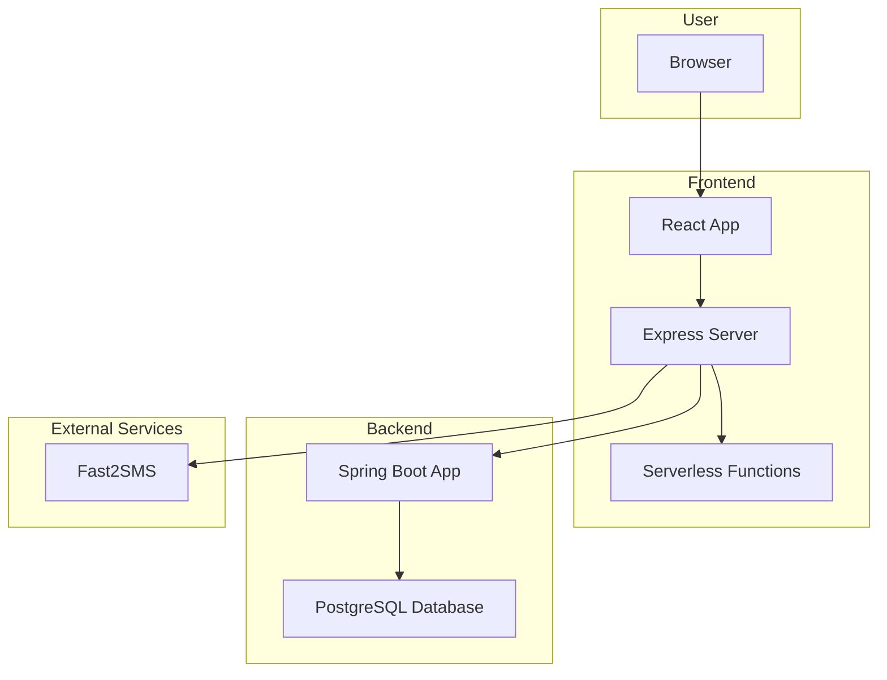

# Professional Tax Portal Architecture

## Architecture Explanation

*   The **User's Browser** is the client-side entry point for all interactions with the Professional Tax Portal.
*   The **Frontend** consists of a **React App** that provides the user interface, an **Express Server** that serves the React app and provides a REST API, and a set of **Serverless Functions** that handle specific tasks. The Express server is the primary backend for the frontend, handling OTP verification, master data, and enrollment. It also communicates with the Spring Boot backend and the Fast2SMS service.
*   The **Backend** consists of a **Spring Boot App** that provides the core business logic and a **PostgreSQL Database** that serves as the primary data store. The Spring Boot app exposes a REST API that is consumed by the Express server.
*   **Fast2SMS** is an external service that is used to send OTPs to users for verification.